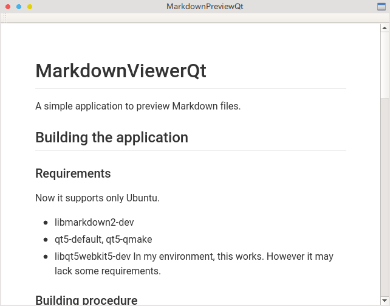

# MarkdownViewerQt

Markdownを閲覧するためだけのシンプルなアプリケーション.

### スクリーンショット

## ビルド

### 要件
現在はUbuntuのみで確認しております.

* libmarkdown2-dev
* qt5-default, qt5-qmake
* libqt5webkit5-dev

当方の環境ではこれで行けるのですが, これだけだと足りないかもしれません.

### ビルド方法
このファイルが置かれているディレクトリに移動します.

~~~
$ mkdir build
$ cd build
$ qmake ..
$ make
~~~

### インストール
このファイルが置かれているディレクトリに移動します.

~~~
$ ./install.sh
~~~

これは標準スタイルシートを`$HOME/.local/share/MarkdownViewerQt/styles.css`として置くスクリプトです.

そして以下を実行してリンクを作成します.

~~~
$ ln -s $PWD/build/MarkdownViewerQt <お好きな場所>/MarkdownViewerQt
~~~

## 使い方/仕様
~~~
$ MarkdownPreviewQt <Markdownファイル>
~~~

このプログラムは`$HOME/.local/share/MarkdownViewerQt/styles.css`を標準CSSとして読み込みMarkdownをHTMLに整形して表示します.

このプログラムは表示したいMarkdownのあるディレクトリに`.preview.html`を生成します. ここに整形したHTMLが含まれており, それをロードすることで表示を行います. .preview.htmlというファイルを置いている場合は上書きするので注意してください.

## バグ
* 表示したいMarkdownの置いてあるディレクトリに`.preview.html`というファイルを上書き作成する.

## ライセンス
MITライセンスを適用します.

Copyright (c) 2018 ryu-raptor
