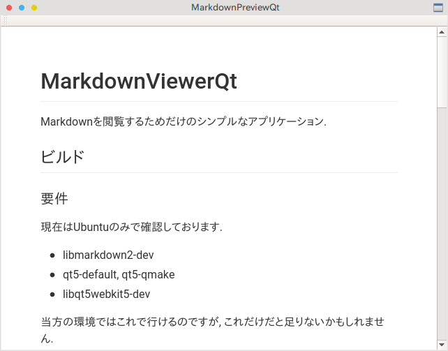

# MarkdownViewerQt

A simple application to preview Markdown files.

### Screenshot

## Building the application

### Requirements
Now it supports only Ubuntu.

* libmarkdown2-dev
* qt5-default, qt5-qmake
* libqt5webkit5-dev

In my environment, this works. However it may lack some requirements.

### Building procedure
Move to the directory this file is located.

~~~
$ mkdir build
$ cd build
$ qmake ..
$ make
~~~

### Installing
Move to the directory this file is located.

~~~
$ ./install.sh
~~~

This script copies a standard CSS stylesheet as `$HOME/.local/share/MarkdownViewerQt/styles.css`
The standard CSS is `./stylesheet/styles.css`.

Then, 

~~~
$ ln -s $PWD/build/MarkdownViewerQt <お好きな場所>/MarkdownViewerQt
~~~

## Usage/Specification
~~~
$ MarkdownPreviewQt <Markdown file>
~~~

This application sets `$HOME/.local/share/MarkdownViewerQt/styles.css` as a standard stylesheet then convert markdown to HTML and show it.

This application creates `.preview.html` on the locations where given Markdown file is located. Note that if `.preview.html` exists there, it will be over written.

## Bugs
* `.preview.html` will be over written.

## License
MIT License is applied to this software.
`./stylesheet/styles.css` is taken from [qlmarkdown](https://github.com/toland/qlmarkdown). Read `./stylesheet/COPYRIGHT` for more infomation.

Copyright (c) 2018 ryu-raptor
